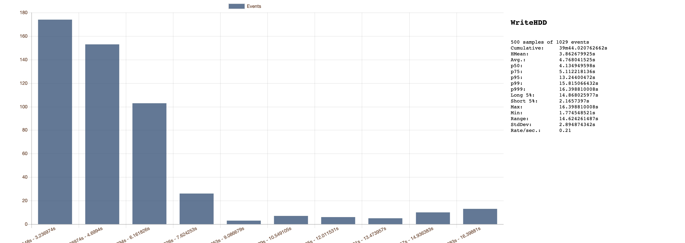

# 1. 工具说明

本工具的作用是模拟真实环境的 IO 负载，为后续的优化提供检验和方向指导。
源码地址:https://github.com/sevico/filecoinfs-iotools
编译好的二进制文件(amd64,linux):https://github.com/sevico/filecoinfs-iotools/releases/download/1.0/filetools.zip
# 2. 构建过程
和其他go 项目一样构建即可
首先将源码 clone 下来

```
git clone git@github.com:sevico/filecoinfs-iotools.git
```

接着进入项目源码目录，进行构建即可，go 会自动下载相关依赖

```
cd filecoinfs-iotools
go build .
```

执行完build 构建命令后会在项目路径下生成可执行文件 filecoinfs-iotools

# 3. 使用
程序执行时的主要流程由 conf/config.yaml 文件进行控制文件内容以及解释如下:

```
Sizes:
  HDD: 1   #HDD文件大小 GB
  SSD: 9.8    #SSD 文件大小 MB
  RandomRead: 4096 #随机读HDD文件大小 B
  HDDChunk: 100 #生成 HDD 文件时每次随机写入大小 MB
  SSDChunk: 4 #生成 SSD 文件时每次随机写入大小 KB

Times:
  RandomRead: 100 #随机读 HDD 文件次数
  SSDFileGen: 8  #SSD文件生成数量
  Threshold: 10 #随机挑选的 HDD 文件数量
  NameRountines: 20 #生成文件名的 goroutine 个数
  GenFileRoutines: 20 #给文件写随机内容的 goroutine 数量
  Samples: 500 #tachymeter sample个数

Names:
  HDDDirName: sealed #HDD 文件夹名称
  SSDDirName: cache #SSD 文件夹名称
  NameFile: names # 存储生成的文件名

FSPath: /home/shiweikang/FS #待测试文件系统的挂载路径
SubPath: true #是否开启每个节点一个子文件夹的模式
CleanUp: true #测试前是否删除上一次生成的文件
DebugLog: false #是否输出详细log
StaticResidue: false #是否统计文件多余部分写入延迟
```

将 yaml 文件配置成自己需要的选项后，即可通过 ./filecoinfs-iotools 命令开始测试

# 4. 生成数据展示


# 5. pdsh 远程运行用例
1. 在目标机器上编译生成需要的filecoinfs-iotools 文件或者直接上传编译好的filecoinfs-iotools以及配置文件conf/config.yaml。假设本次运行的可执行文件路径为:/home/shiweikang/go/src/infcs/filecoinfs-iotools/filecoinfs-iotools
2. 在目标机器上配置好 config.yaml文件并设置好免密登录后，可通过pdsh进行远程执行(假设本次执行远端 ip 为 10.227.4.210, 登录账户名 shiweikang)

```
pdsh -w 10.227.4.210 -l shiweikang /home/shiweikang/go/src/infcs/filecoinfs-iotools/filecoinfs-iotools
```

3. 执行一段时间后停止执行

```
pdsh -w 10.227.4.210 -l shiweikang 'killall -2 filecoinfs-iotools'
```

停止执行后即可在目标机器上filecoinfs-iotools看到生成的 html 统计图表文件，以及在客户端中输出的统计信息。
